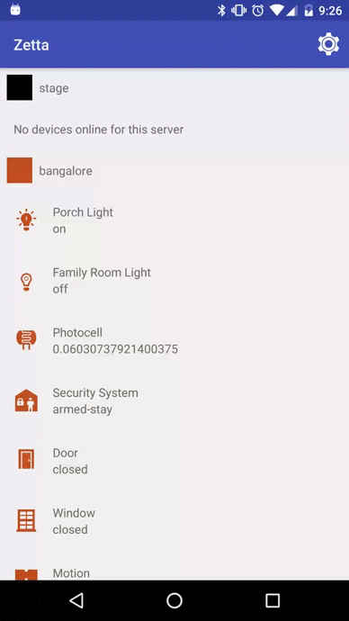

# zetta-starter-app-android

To use this app:

 - Go to the settings screen and add a Zetta server
 - You will see a list of devices from that server with real time data updates
 - You can navigate and click a device to see more information as well as toggle fields
 - Long press a device in the list for quick action access

### Compiling this app requires a local release of the SDK

See: https://github.com/zettaapi/zetta-sdk-android/pull/1

### Latest APK file can always be found on the releases page

https://github.com/zettaapi/zetta-starter-app-android/releases

## Overview

This app demonstrates the capabilities of the [Zetta Android SDK](https://github.com/zettaapi/zetta-sdk-android)
the SDK wraps a [siren spec json feed](https://github.com/kevinswiber/siren) and allows easy access to the details of IoT Servers and devices on those servers.

## Features

### Browsing Server & Device list
- Shows a list of Servers, under the title of each server shows a all attached devices
- Hides and shows devices depending on the style and display properties
- Themes each individual device according to it's style properties, if it doesn't have style it inherits the servers syle
- Each device displays a name, a state icon, and state text
- Monitors for changes to these devices and updates the icon & state for each update
- short clicking on a device takes you to its details
- long clicking on a device shows you a list of available actions
- pulling the list down allows you to refresh the device list
- pressing the settings cog allows you to go to the device settings

### Settings
- you can set a root url for which you want to monitor server and devices
- when you set the root url it eagerly prefetches data to try to improve responsiveness
- you can toggle 'demo mode' on and off, demo mode allows you to see the app working without a root url / internet connection
- you can see a list of open source licenses for sdk's we use

### Device Details
- Shows a list of device details, including actions, streams, properties and events
- actions are commands that you can perform on the device, they can take no input, a single text input, or multiple inputs
- streams are the devices changing state information, ex a car's mph
- properties are the devices details they don't have to change as often as streams do
- events is a history of all things about the device, like a detailed log
- Themes the device according to it's style properties, if it doesn't have style it inherits the servers syle
- The device is constantly refreshing as the device streams are updated
- Shows a promoted property if this is requested in the style, otherwise shows the devices state

### Events
- Shows a list of events happening to an individual device
- This is updated in realtime and they are ordered newest first

## Architecture

This application goes somewhere towards the idea of a Model in MVP. The returned objects from the zetta api are converted into
view objects that are simple pojo's for displaying data. Each pojo has an id and this is how we can look the original object back up.
The idea is to have a separation between the UI layer/display logic and the backend domain.

If we where to describe the typical flow of data using the Server & Device list screen as an example
 - Activity starts and we set up all our view references and needed dependencies
 - Activity resumes and we check if a URL has been set (from the settings screen)
 - If we have a URL, the Activity asks the DeviceListService to get the devices
 - The DeviceListService is in charge of threading and so moves us to a background thread
 - Now depending if we have Demo Mode set, we either retrive the devices from a MockDeviceListService or a SdkDeviceListService
 - the SdkDeviceListServer requests the servers & devices from the ZettaSdkApi and then converts these into our model (ListItems)
 - the ZettaSdkApi asks the Zetta SDK for the servers & devices, caching responses for later lookup
 - When the data is returned to the Activity we update our view with the server and devices ListItems

To explain that in terms of roles:
 - DeviceListActivity: acts a bit like a presenter and a view
 - DeviceListService: controls threading & backend choice
 - DeviceListMockService: returns mock data so we can skip using the Zetta SDK
 - DeviceListSdkService: converts the data from Zetta SDK into ListItems
 - ZettaSdkApi: wraps the Zetta SDK to add caching & control method call order/callbacks/throttling

